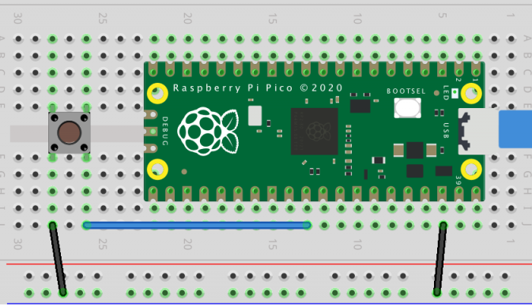

# Pi Pico Demo Blinking Led Using Modern Cpp

In this demo of a blinking LED, we can probe and see how Modern CPP can be used to write code for the Raspberry Pico.
The result is as simple as getting the Pico’s onboard (GPIO 25) LED blinking. 
No additional hardware is needed then.

To debug the code (there might be better techniques) I used the serial (USB mode) printing methods that the C/C++ SDK API provides, so it should be easy to connect and see the output using any serial terminal in your PC.

## This code includes:
* Encapsulation (A Led Class)
* Abstractions (Qualifiers)
* RAII by using a unique pointer
* The main file has .cpp extension 
* Sending messages to the terminal through cout (it is also possible using puts and some other methods provided by the SDK)
* It is a multi file project

## Building the code
I used a Windows system while working on this project so the CMake command to build it are the following:
```bash
mkdir build
cd build
cmake -G "NMake Makefiles" ..
nmake
```
In case you need information of how to build it on Mac and Linux I strongly recommend the [Getting Started Guide](https://datasheets.raspberrypi.org/pico/getting-started-with-pico.pdf) provided by Raspberry. It is a well-documented way to go with.

# Schematic
You don't really need any additional hardware but just in case you want to add a reset button to avoid being connecting and disconnecting every time you need to program the board here is an image that can be helpful. 


# Serial Output
This is what you will see on a serial terminal (TeraTerm, Putty, CoolTer, RealTerm, and so on).
